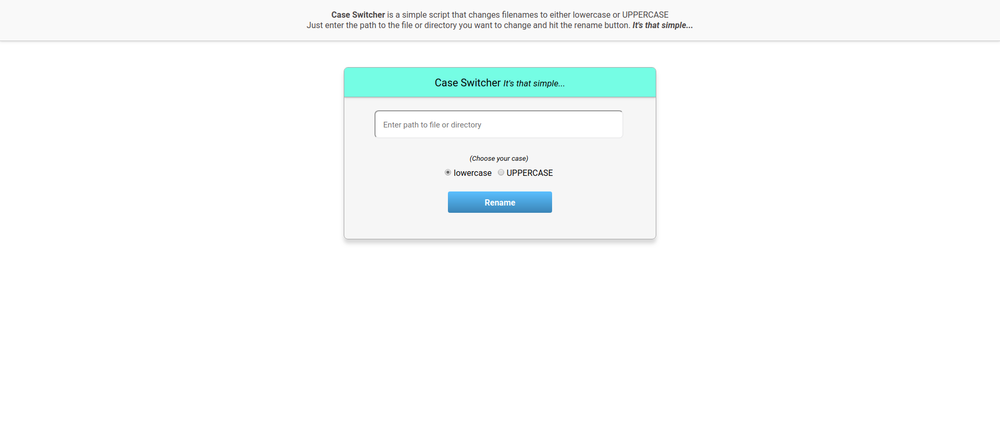

# CaseSwitcher _It's that simple..._
### CaseSwitcher is a tiny system that allows you to change or rename files to lowercase or UPPERCASE by clicking one button. _Its that simple..._  

## BABY STEPS :baby:
**Current Version:** 0.1.2-beta
**Tested on:** Linux (elementary OS) - Should work on UNIX like systems

**CaseSwitcher** is still taking baby steps, so handle with care. This is a beta release. Please **DO NOT** test it on important files or directories. Test it on less critical files and directories.
**You've been warned** :smirk:

### REQUIRES
PHP Version: 7.0.25+

### USE CASE
Consider the situation where you (using a UNIX system - Linux/Mac) and a friend on a Windows system sends you an project to work on. You open the folder and you realize that all the files are in uppercase or title case. This becomes problematic because the UNIX file system is case sensitive. This will mean that you will have to carefully change the file names to lowercase for your system. In such a situation, **CaseSwitcher** is your best friend.

### LET'S AGREE ON THESE :punch:
- **CODING STYLE:** [PSR-1](https://www.php-fig.org/psr/psr-1/) and [PSR-2](https://www.php-fig.org/psr/psr-2/)
- **CONTRIBUTING:**  
    - First of all, be gentle and kind. This should be a learning experience.
    - Go ahead and file an issue, make a request, report a bug, offer an improvement etc...
    - Pull requests are eagerly welcome.
